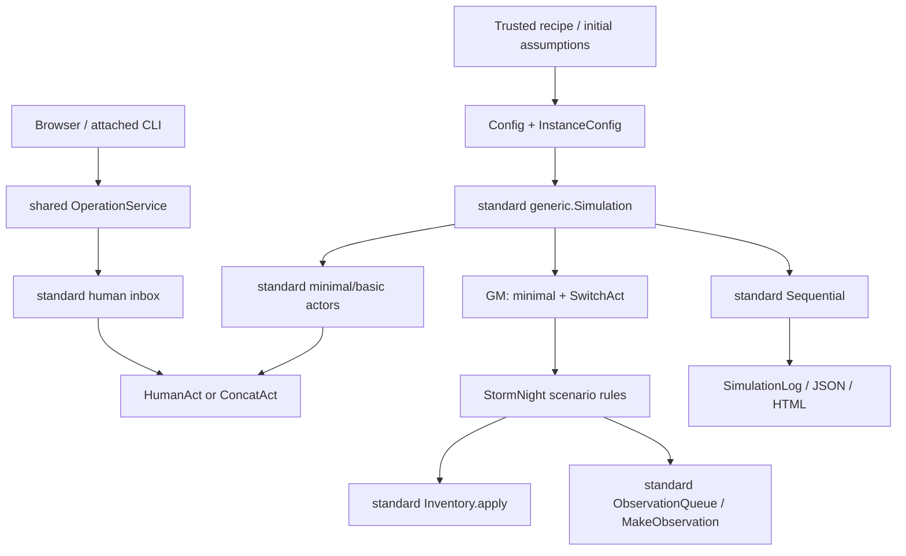

# Bellwether researcher starter kit

Bellwether is a fictional teaching scenario and software demonstration. Its
records establish what *this program* resolved, not facts about a society.
These recipes help contributors make explicit changes without replacing
Concordia's engine or confusing narrative with enforcement.

## Start here

From this contribution's source checkout:

```sh
python -m pip install -e '.[dev]'
python -m pytest -o addopts='' concordia/examples/bellwether/researcher_test.py -q
```

The tests construct standard entities and check declared rules; they do not
call a live model or launch a simulation. To play the unmodified browser game,
use [GAME.md](GAME.md), or [MULTIPLAYER.md](MULTIPLAYER.md) for host-approved
Coordinator/Nell sessions. Voice is an optional [presentation aid](VOICE.md).

### A terminal teaching case

Save this as `my_case.py` in your checkout:

```python
from pathlib import Path
import numpy as np

from concordia.environment.engines import sequential
from concordia.examples.astral_canticle.terminal import TerminalInput
from concordia.examples.bellwether import game_prefab, researcher
from concordia.prefabs.simulation import generic

case = researcher.prepare_case('institutional-dispute', TerminalInput())
simulation = generic.Simulation(
    case.config,
    game_prefab.FixtureModel(),  # scripted decisions, not live residents
    lambda text: np.zeros(8),   # fixture-only embedding, no semantic retrieval
    engine=sequential.Sequential(),
)
log = simulation.play(max_steps=64)
output = Path('runs/my-case')
output.mkdir(parents=True, exist_ok=True)
(output / 'trace.json').write_text(log.to_json(), encoding='utf-8')
(output / 'trace.html').write_text(log.to_html(), encoding='utf-8')
```

Run `python my_case.py`. The standard human component prints the controlled
entity's ordered context and asks for your text. Use the commands in GAME.md.
The scripted fixture cooperates on requests; use it to check wiring, not to
measure social strategy. A max-step limit may stop before dawn; inspect
`case.world.finished` rather than calling a partial trace a complete night.

The recipe helper only prepares a standard Config and fresh scenario component.
It does **not** run an engine, start a server, upload data, import user-supplied
Python, or serialize live human readers. Call it anew for every run; do not
reuse a built Config's attached components. These are headless/terminal recipe
examples, not a new browser project editor. The browser supports explicit recipe
selection and a separate baseline `--dispute-file` option as described below.

## Architecture and ownership



| File / symbol | Responsibility | Must not be treated as |
|---|---|---|
| `researcher.prepare_case` | Fresh trusted Config/world and declared initial assumptions | Arbitrary project serialization or experiment runner |
| `game_prefab.configuration`, `Resident.build` | Standard prefab selection and per-actor goals, private accounts, affiliations and optional human readers | New agent architecture |
| `game.StormNight` | Explicit agenda, consent, repair, watch accounting, recipient projection | Alternative simulation engine or a social theory |
| `Inventory.apply` | Atomic validated item deltas | LLM narration of a transfer |
| `SwitchAct` + `Signal` | GM action-spec, next-actor and termination routing | A human or narrator overriding consent |
| `MakeObservation` + `ObservationQueue` | Deliver only addressed observations | A globally visible event feed |
| `generic.Simulation` + `Sequential` | Construct entities, execute standard phases and record logs | A deterministic hosted-model replay promise |
| `game_service.Game` | One browser run, revisioned operations and lifecycle | Initial-project editing or checkpoint restoration |
| `multiplayer.SharedGame` | Independent approved role views and existing human inboxes | Remote authentication based on a port or role name |
| `SimulationLog` | Recorded prompts/events/state evidence | Empirical warrant for a policy conclusion |

The GM and each entity own distinct context components; each new case owns
its inventory and observation queue. Standard minimal/basic builds retain their
normal components and acting order. Basic's perceptions make additional model
calls; enabling a human final action does not automatically disable its
LLM-backed context processing.

## Included analogous recipes

All cases deliberately retain the five fixed Bellwether role IDs and three
facility IDs so existing parsing, scheduling and accounting remain meaningful.
They are variations of one resource-sharing skeleton, not arbitrary-world
generators.

| Recipe | Explicit change | Expected software effect | Not implied |
|---|---|---|---|
| `bellwether` | Original initial context and ledger | Baseline8 fuel,1 part,9 facility-watches | Fixture cooperation predicts people |
| `mutual-aid` | Ferry evacuation framing, Sam's goal/private report,2 fuel already consumed before play | Generator4 + reserve2 + Used2; only6 usable fuel, so even repair leaves unmet demand | Missing fuel vanished; the rumor is objective fact |
| `resource-governance` | Proposed transparent reserve charter and Nell's goal | Same text appears in institutional view and member context; dialogue may differ with a live model | New voting, sanction or veto enforcement exists |
| `institutional-dispute` | Different private recollections; High Tide note goes only to Mara/Nell | Coordinator/Ivo/Sam/spectator do not receive the direct note | Recipients cannot choose later to disclose it; either recollection is true |

`case.manifest` records fixed IDs, engine, human roles, accounting baseline and
evidence class without exporting private accounts. For mutual aid,
`epilogue.fuel_used` is the **cumulative Used ledger**, including2 pre-play units.
Subtract `manifest['fuel_consumed_before_play']` to measure in-run consumption.
Do not compare it to the baseline as if both started at zero.

## Tested modifications and extension boundaries

### Private information and setting

The recipe changes both the actor's `PreviousStormAccount` Constant and the
recipient-scoped initial observation. It does not leave a conflicting default
account in the queue. `StormNight.seed(opening=..., accounts=...)` validates all
resident names/text before emitting anything. Use `world.emit(..., audience=[...])`
for delivered facts/claims; a character goal or hidden account is not public.
Public player projections must not include developer checkpoints or raw logs.

For browser use, `run --dispute-file file.json` accepts exactly:

```json
{"text":"A disputed claim, not established history.","recipients":["Mara","Nell"]}
```

This changes a delivered account, not past objective events. Never patch module
globals to customize simultaneous runs.

### Institutions: rule, belief, enforcement, compliance

`StormNight(..., institutions=[...])` accepts unique named institutions with
known members and text `rule`/`enforcement` fields. The same per-world list
feeds member affiliation components and the player view; defaults are unchanged.
For example:

```python
institutions = [{
    'name': 'Mutual aid council',
    'members': ['Nell', 'Ivo', 'Sam'],
    'rule': 'Propose public notice before reserve release.',
    'enforcement': 'Proposal only; existing owner consent remains the gate.',
}]
```

Text is an actor-facing institutional description, **not executable authority**.
Changing actual enforcement requires a reviewed change to the relevant
`StormNight._human` / `_resident` transitions, explicit new records and tests
for refusal, revocation, unauthorized attempts and boundary timing. Do not
replace the consent gate with a prompt asking a narrator to infer compliance.
Membership, agreement, intended action and performed labor are separate facts.

### Scarcity, repair and outcomes

The supported teaching scarcity variation uses standard inventory transfers to
record prior consumption. Total conservation stays8 fuel and1 part. Changing
total resource supply, transfer amounts or facility demand beyond that requires
coordinated edits to `new_inventory`, invariants, reserve contract, opening,
repair/boundary rules, UI and outcome definitions. A hidden Constant edit alone
does not change inventory and must not be reported as a scarcity intervention.

Likewise, changing `CONSEQUENCES` wording changes presentation, not the number
of supplied facility-watches. Add a new outcome only with an explicit data
source, denominator and interpretation. Tests should check changed transitions,
not assert a desired political narrative or winner.

### Actor policy, human roles and roster

```python
case = researcher.prepare_case(
    'resource-governance',
    coordinator_reader,
    actor_logic='basic',
    human_readers={'Nell': nell_reader},
)
```

Both readers use the existing transport-neutral HumanInput protocol; role
authorization remains the transport's responsibility. Other residents retain
ConcatAct. Choose `minimal` or `basic` without copying their build functions.
Individual trusted InstanceConfig `decision_logic`, `goal` and `account`
parameters can be edited **before** building Simulation.

For live actors supply a local model through standard
`Simulation(..., override_agent_model=...)`, retaining the explicit GM policy.
Reuse the call-limit, profiling and bounded Ollama configuration in `run.py`;
do not silently fall back to fixture behavior on model errors. Zero embeddings
in the teaching snippet are not a realistic basic-agent retrieval setup.
For real local vectors use the optional callable adapter described in
[GAME.md](GAME.md#optional-local-memory-embeddings). The same embedder can be
passed directly to standard `generic.Simulation` in this terminal example.
Record the selected embedding model alongside the actor model and assumptions;
one small successful retrieval probe is not evidence of general memory quality.

Humanizing a known resident via `human_readers` is supported. Arbitrary roster
size is **not** a one-line Bellwether option: add role/prefab instances, parser
targets, request ownership, observation recipients, agenda/dawn rules, role UI
and invariants together. The current browser authorizes only Coordinator/Nell
plus a spectator. Standard Config supports other entities, but this scenario's
fixed consent and resource contracts still name Nell/Ivo. Unknown role mappings
are rejected rather than silently ignored.

### GM policy and other engines

The existing GM composes standard SwitchAct with explicit rules. Alternative
GM context/action components can be composed through a trusted Config, but must
implement the selected engine's action-spec and next-actor contracts and
preserve declared observation/privacy boundaries. A new narrator is not
permission to grant consent or invent resources.

The main game stays Sequential. Merely passing another engine is not a verified
variant: different scheduling/action-spec contracts can invalidate an agenda
designed for one actor at a time. A subsequent standard-engine example should
document and test those differences, not implement a replacement loop.

## Validation, traces and research limits

`researcher_test.py` constructs every recipe using standard Simulation,
checks minimal/basic human-vs-AI policies, fresh component ownership, exact
private account seeding, recipient-bound dispute delivery, valid/invalid
institution state and conservation. Direct rule tests are unit checks, not
live-model runs. The bounded integration smoke uses a scripted fixture and
standard Sequential; a completed night still says nothing about human validity.

Keep the original configuration, explicit assumptions, backend/model/options,
software revision, human inputs, intervention timestamps and full raw trace
when doing private analysis. Logs include private prompts/memories: do not give
raw JSON/HTML to a player or public spectator. Export only intentionally
sanitized recipient projections. Seeds with hosted models are not a guarantee
of deterministic replay. Component state serialization is not a complete
checkpoint/engine continuation contract; create new independent cases until
that contract is implemented and verified.

Research needs plural decision logic and a defensible design, not just fluent
dialogue: state hypotheses in advance, justify observations/outcomes, record
counterexamples, separate rules from beliefs/enforcement/compliance, and seek
external evidence. No scripted scientific conclusion, policy recommendation,
trust score, human usability result or social generalization follows from this
fixture, these tests, or a single local-model night.

## Standard-engine companion

[ENGINES.md](ENGINES.md) provides a runnable simultaneous resource council,
actual scheduling/API differences, and explicit asynchronous limitations.
The main Bellwether night remains Sequential.

## Select the same initial case in the browser

From this source checkout, choose a named trusted recipe explicitly:

```sh
python -m concordia.examples.bellwether.run --mode fixture \
  --recipe mutual-aid --editor-port 8784 --player-port 8785 \
  --output runs/mutual-aid-fixture
```

Open the printed **Player** URL. The page labels the teaching case and its
initial assumptions. **Begin the night** is explicit; opening/reloading the
page never runs or resets a simulation. The server uses the exact
`prepare_case` Config/world described above, not a copied recipe interpreter.
For the host-approved two-human path add `--multiplayer`; Coordinator and Nell
retain their own input and observation scope. The host must approve both players.
Other residents keep the selected standard minimal/basic policy.

Choose from `bellwether` (unchanged default), `mutual-aid`,
`resource-governance`, or `institutional-dispute`. To use available local
residents, replace `--mode fixture` with `--mode live --model llama3.2:3b`;
fixture results do not establish live behavior. This change verifies initial
recipe selection, not another live night or human usability result.

`--recipe` is an initial-launch choice, **not** an editor operation for changing
an active game. Use a different output directory and unused ports for each
independent night. The one-turn `--mode slice` excludes non-default recipes.
`--dispute-file` is supported only with `--recipe bellwether`; combining it
with another case is rejected before reading the file or constructing a model
or service. No file may supply importable Python or a new recipe name.

The mutual-aid case starts with Generator4 + reserve2 + Used2. **Used is a
cumulative ledger**: two units were consumed before play. The browser labels
this condition and the public account includes the declared opening/initial
condition events. The dawn `fuel_used` field remains cumulative for compatibility;
subtract the manifest's `fuel_consumed_before_play` when measuring in-night
consumption. This is not a post-hoc deletion of resources or an experimental
comparison with a shared baseline.

The saved `outcome.json` player projection and developer initial view include
the public recipe manifest (not private account text). Existing JSON/HTML raw
traces still contain private context and must remain host-only. The public
account continues to omit recipient-only dispute notes and private accounts.

Regression checks compare exact initial actor states, Config instances and
worlds against independent headless builds for every recipe and both standard
policies. Chromium verifies 360px openings, initial stocks/charters, reload and
host-approved recipient-only dispute delivery using a component fixture. These
checks do not invoke Simulation.play or a model; existing full-game execution
wiring is unchanged. Checkpoint, arbitrary project authoring, experimental and
physical-device acceptance remain separate.

## Image input versus presentation

The public service figure is a presentation artifact. [Visual notes](VISUAL-NOTES.md)
instead send bounded normalized pixels to an explicitly selected local vision
model and return a separate human-review draft. There is no automatic path into
an actor observation or scientific evidence. The standard actor interface stays
text-only; do not attach a player's private image to a model instance shared by
other roles.


### Setup context in a public account

Saved public JSON, readable HTML and the public SVG now carry the trusted
recipe's declared setup: recipe name, standard actor prefab/engine, human role
names and initial fuel assumptions. The mutual-aid recipe declares two units
used before play and six initially available; cumulative Used must not be
confused with consumption during play.

This optional public projection is **not a complete run configuration**.
Private component edits, initial memories, prompts, model settings, browser
identities and session references are excluded. A recipe label neither captures
all interventions nor guarantees deterministic replay or empirical validity.
World-only/older records without setup provenance remain explicitly unknown;
the exporter never infers setup from later stock or narrative.
